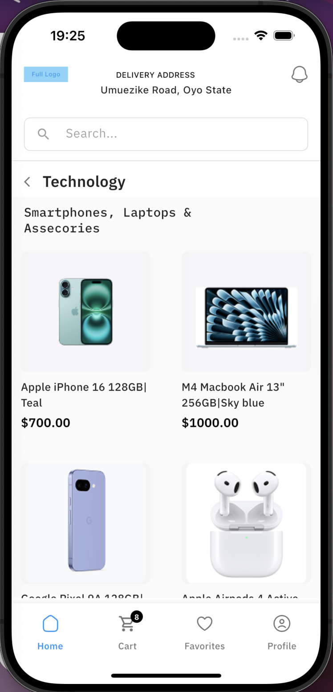
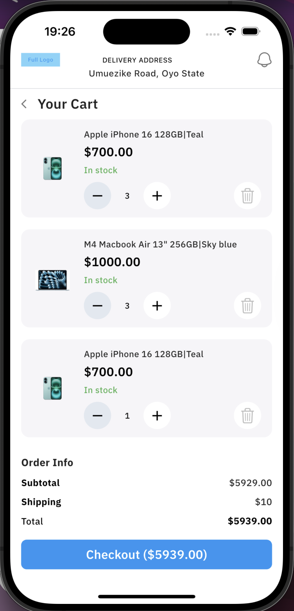
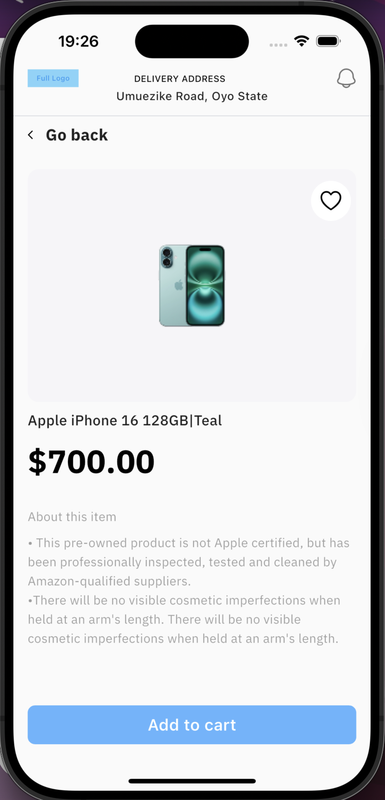
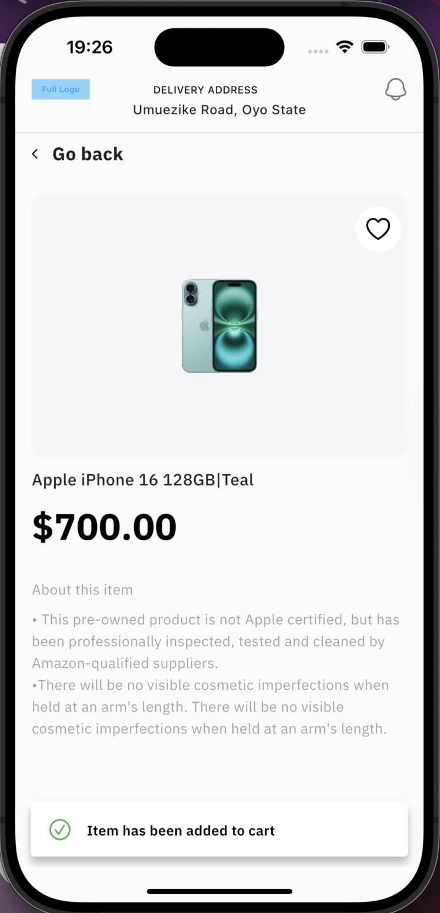
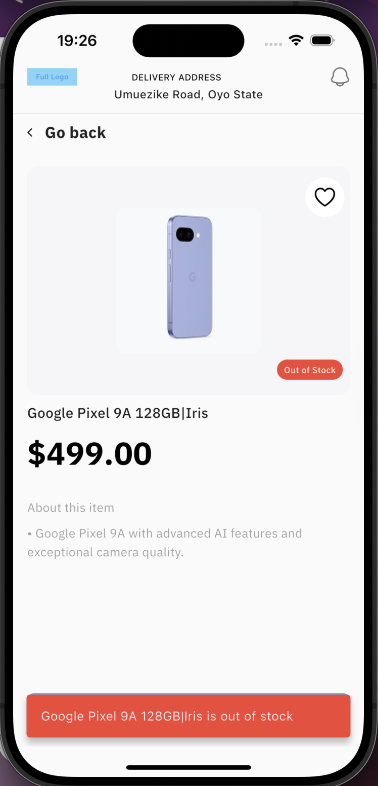
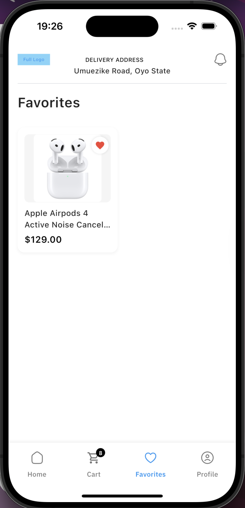

# bello-task
# A 3 Screen E-commerce flutter application
# For this project, The tech stack used are;
# -  Flutter and Dart
  
# Setup/Run Instructions
# -  Open the project folder in visual studio code or android studio
# -  Under the folder lib, the main.dart file is the entry point of the flutter application, you can use the Run button or use f5 to run the app.
# -  Make sure you're connected to either a simulator, emulator or a physical android device
  

# screenshots

## home page

## cart page

## product detail page

## favorite page
